## Nama Averose Arthur R
## TI-2G

## 1. Kode

 1. Class Bike 

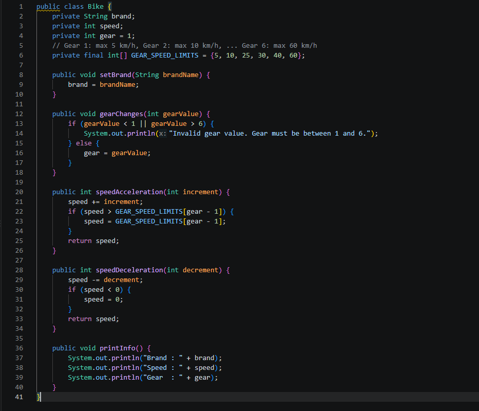

 2. Class Bike Demo

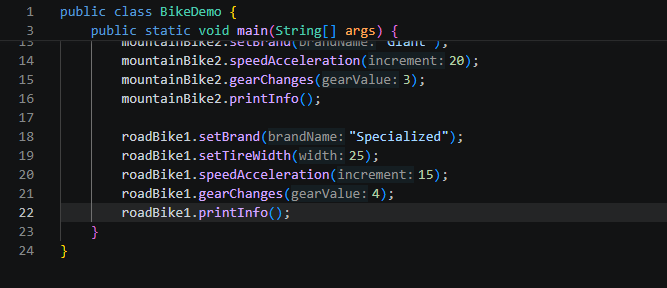

 3. Class Road Bike

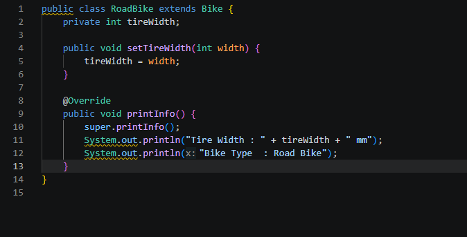
 
 4. Hasil

 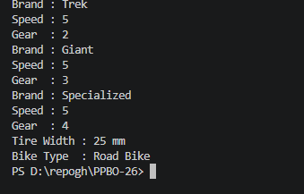

## 2. Jawab Pertanyaan
 1. Jelaskan perbedaan antara object dengan class!
  Class Befungsi sebagai pemberi definisi tehadap objek (sifat suatu objek)

  Objek adalah wujud dari class yang sudah diberi data lewat komputer

 2. Jelaskan alasan gear dan brand dapat menjadi atribut dari object Bike!
 Karena keduanya mewakili karakteristik/state dari sebuah sepeda

 brand menyimpan identitas merek sepeda, sedangkan gear menyimpan kondisi gigi sepeda saat ini

 3. Sebutkan salah satu kelebihan utama dari pemrograman berorientasi objek dibandingkan
 dengan pemrograman prosedural!

Reusability, Kode dapat digunakan kembali melalui inheritance tanpa perlu menulis ulang

Modularitas & Kemudahan Maintenance: Program terbagi menjadi objek-objek terisolasi sehingga lebih mudah dikembangkan, dilacak saat ada bug

 4. Apakah diperbolehkan melakukan pendefinisian dua buah atribut dalam satu baris kode seperti
 “public String nama, alamat;”?

 Diperbolehkan. Dalam bahasa Java, beberapa variabel dengan tipe data yang sama dapat dideklarasikan dalam satu baris dengan dipisahkan tanda koma (,).

 5. Pada class RoadBike, jelaskan alasan atribut brand, speed, dan gear tidak lagi ditulis di dalam
 class tersebut!

 Karena RoadBike melakukan Inheritance (Pewarisan) dari class Bike melalui kata kunci extends Bike. Otomatis, semua atribut bertipe non-private atau atribut yang diakses via setter/getter milik Bike secara langsung diwarisi oleh RoadBike, sehingga tidak perlu dideklarasikan ulang (menerapkan prinsip Code Reusability).

## Tugas praktikum 
1.  Monitor Gaming (Subclass dari Monitor)

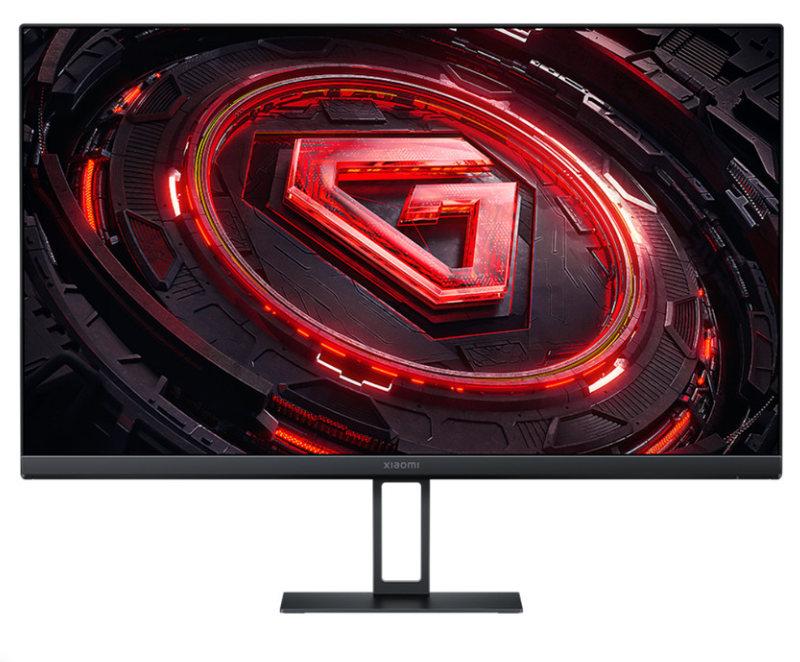

    Monitor Kantor (Subclass dari Monitor)

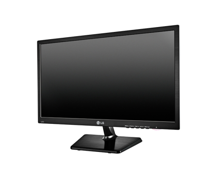

Keyboard 

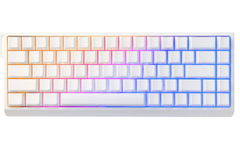

Mouse

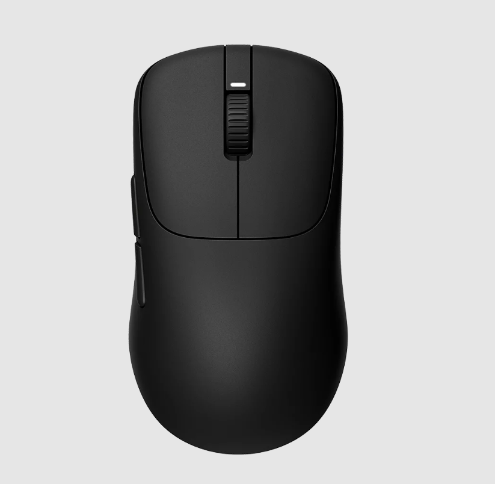    

2. 
    1. Objek: Monitor Gaming (Subclass)
Monitor ini khusus untuk bermain game. Karena mewarisi (inherit) sifat dari class Monitor, atribut dasar monitor ditambah ciri khasnya.

Atribut (Data/Karakteristik):
refreshRate fiturRgb

Method
aktifkanModeGaming() setRefreshRate() cetakInformasi()

    2. Objek: Monitor Kantor (Subclass)
dirancang untuk bekerja dalam waktu lama di kantor mewarisi class Monitor.

Atribut (Data/Karakteristik):
hematEnergi filterCahayaBiru 

Method
aktifkanFilterCahaya() setModeHemat() cetakInformasi() 

    3. Objek: Keyboard (Independen)
tidak memiliki hubungan pewarisan dengan monitor.

Atribut (Data/Karakteristik):

jenisTuts koneksi

Method
ketik() nyalakanLampu() cetakInformasi() 

    4. Objek: Mouse (Independen)
Benda berdiri sendiri.

Atribut
dpi jumlahTombol

Method
klikKiri() scroll() cetakInformasi()

3. 
c. Berdasarkan 4 buah objek tersebut, buat class nya dalam Bahasa pemrograman Java!
d. Perlu diperhatikan bahwa terdapat dua class hasil pewarisan sehingga perlu menambah satu
class baru sebagai class yang mewarisi dua class tersebut!  
e. Tambahkan dua atribut untuk setiap class!
f. Tambahkan tiga method untuk setiap class termasuk method cetak informasi!
g. Tambahkan satu class Demo sebagai main!h. Instansiasikan satu buah objek untuk setiap class!
i. Terapkan setiap method untuk setiap objek yang dibuat!

Hasil kode

1. Demo.java

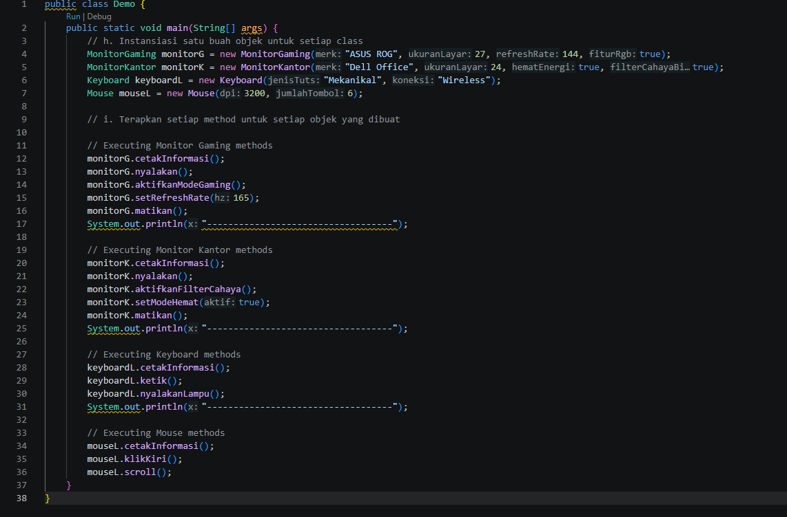

2. (SuperClass) Monitor.java

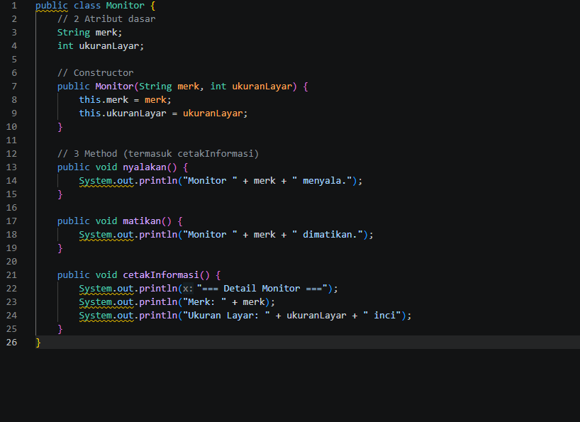

3. MonitorGaming.java

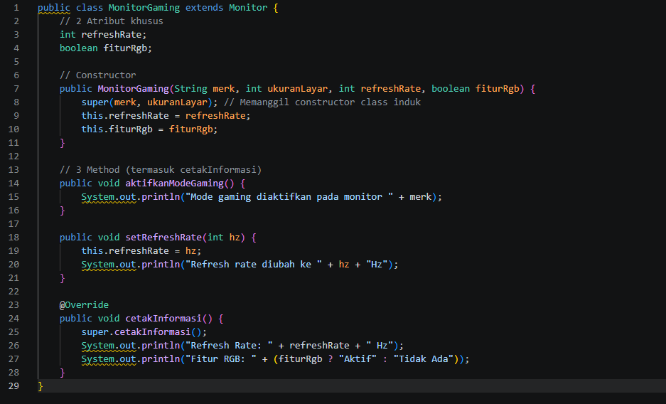

4. MonitorKantor.java

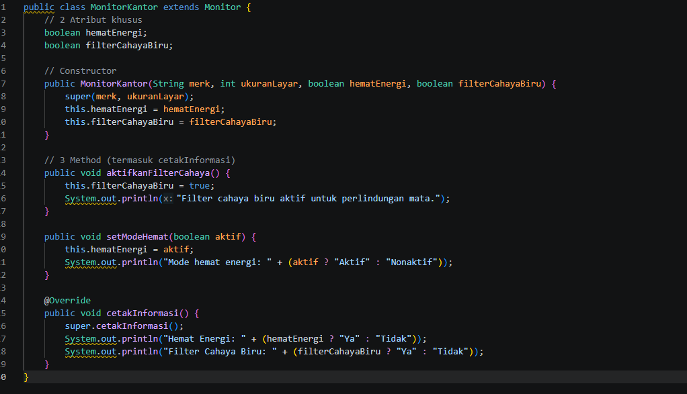

5. (idp) Keyboard.java

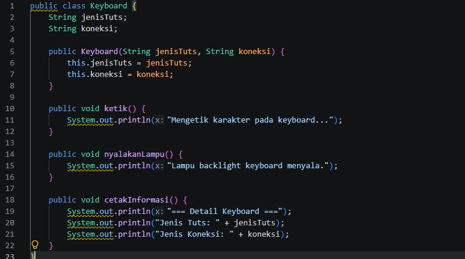

6. (idp) Mouse.java

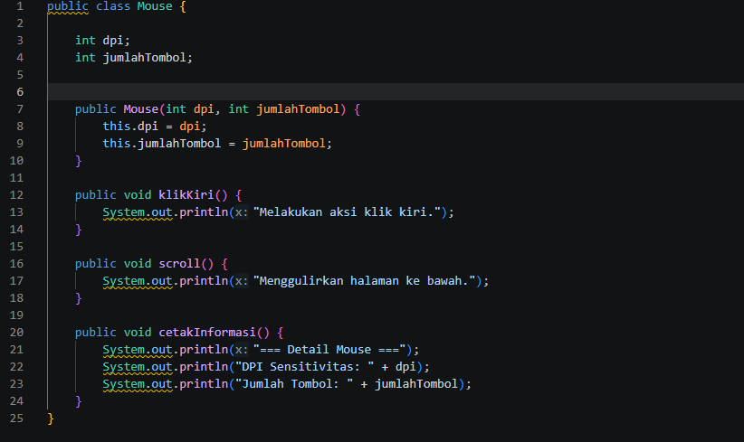

7. Hasil

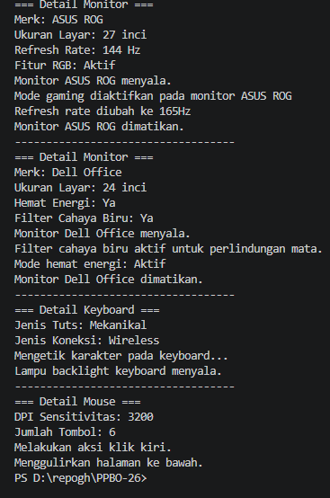