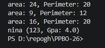

## Averose Arthur R
## TI-2G / Jobsheet 2 PPBO

1. 

2. 

public class circle {

    private double radius;

    // Konstruktor (+Circle(radius : double))
    public circle(double radius) {
        this.radius = radius;
    }

    // Method untuk menghitung luas (+area() : double)
    public double area() {
        return Math.PI * radius * radius;
    }

    // Method untuk menghitung keliling (+circumference() : double)
    public double circumference() {
        return 2 * Math.PI * radius;
    }
}

## Main baru
public class main {
    public static void main(String[] args) {
        Rectangle[] shapes = new Rectangle[3];
        
        shapes[0] = new Rectangle(6,  4);
        shapes[1] = new Rectangle(3, 3);
        shapes[2] = new Rectangle(8, 2);

        for (Rectangle r : shapes){
            System.out.println("area: " + r.area() + ", Perimeter: " + r.perimeter());
        }
        

       circle c = new circle(5);
        System.out.println("Luas lingkaran: " + c.area());
        System.out.println("Keliling lingkaran: " + c.circumference());
        

       

       Student s = new Student("nina", "123", 4);
       System.out.println(s.describe());

}
}

output
area: 24, Perimeter: 20
area: 9, Perimeter: 12
area: 16, Perimeter: 20
Luas lingkaran: 78.53981633974483
Keliling lingkaran: 31.41592653589793
nina (123, Gpa: 4.0)

(a) Bedanya objek dengan referensi ke objek:
Objek adalah sesuatu nyata yang dibuat di memori heap dan berisi data serta method dari suatu kelas. referensi ke objek adalah variabel yang menyimpan memori tempat objek tersebut dialokasikan

(b) Kapan tepatnya konstruktor sebuah kelas dijalankan:
Konstruktor dijalankan secara otomatis saat sebuah objek dibuat menggunakan kata kunci new. Proses ini terjadi tepat ketika memori untuk objek baru dialokasikan untuk menginisialisasi atribut awal kelas tersebut.
